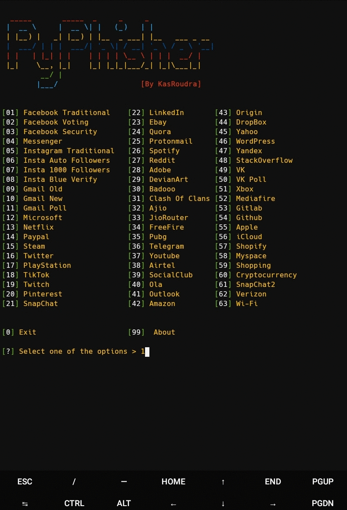

<h1 align="center">PyPhisher</h1>

<p align="center">
  
  
  
  
     
<br>
<br>
  
  
  
  
</p>


### [+] Descripcion :

***Última herramienta de phishing en python. Incluye sitios web populares como facebook, twitter, instagram, github, reddit, gmail y muchos otros.***

### [+] Installation

##### Instalar dependencias primarias (git y python)

 - For Debian
    - ```sudo apt install git python -y```
 - For Arch
    - ```sudo pacman -S git python --noconfirm```
 - For Fedora
    - ```sudo yum install git python -y```
 - For Termux
    - ```pkg install git python -y```

##### Clonar este repositorio

 - ```git clone https://github.com/luis498/PyPhisher```

##### Entrar en el directorio
 - ```cd PyPhisher```

##### Ejecute la herramienta
 - ```python3 pyphisher.py```

#### O directamente ejecutar
```
wget https://raw.githubusercontent.com/luis498/PyPhisher/master/pyphisher.py && python3 pyphisher.py

```

### Características:

- Multiplataforma (Soporta la mayoría de Linux)
- 65 plantillas de sitios web
- Tunelización dual (Ngrok y Cloudflared)
- Fácil de usar
- Diagnóstico de posibles errores
- Enmascaramiento incorporado de url
- Enmascaramiento personalizado de url
- Archivo portátil (se puede ejecutar desde cualquier directorio)
- Obtenga la dirección IP y muchos otros detalles junto con las credenciales de inicio de sesión
  
### Requirements

 - `Python(3)`
 - `PHP`
 - `Curl`
 - `Unzip`
 - `Wget`
 - 100MB storage 
 
Si no se encuentra, todos los paquetes necesarios se instalarán en la primera ejecución

#### Tested on

 - `Termux`
 - `Kali-Linux`

## Usage

1. Ejecute el script
2. Elija un sitio web
3. Espere a veces para configurar todo
4. Enviar el enlace generado a la víctima
5. Espere a que la víctima inicie sesión. Tan pronto como inicie sesión, se capturarán las credenciales

<h1 align="center">Example</h1>



## Video Tutorial
<a href="https://rebrand.ly/pyphishervideo">PyPhisher Video</a>

## [+] Descargo de responsabilidad
***Esta herramienta está desarrollada con fines educativos. Aquí demuestra cómo funciona el phishing. Si alguien quiere obtener acceso no autorizado a las redes sociales de alguien, puede intentarlo bajo su propio riesgo. Usted tiene sus propias responsabilidades y es responsable de cualquier daño o violación de las leyes por parte de esta herramienta. ¡El autor no es responsable del mal uso de PyPhisher!***

### Este repositorio es de código abierto para ayudar a otros. Entonces, si desea copiar, ¡considere dar crédito!

## Credits: <a href="https://github.com/htr-tech/zphisher">HTR-Tech</a> and <a href="https://github.com/jaykali/maskphish">JayKali</a>

####  Si esta herramienta te ayudó, considera mirar el repositorio. Tus estrellas me animan mucho!

## [+]Encuéntrame en :
<ul>
<li><a href="https://facebook.com/"></a></li>
<li><a href="https://m.me/"></a></li>
<li><a href="mailto://@gmail.com"></a></li>
</ul>
